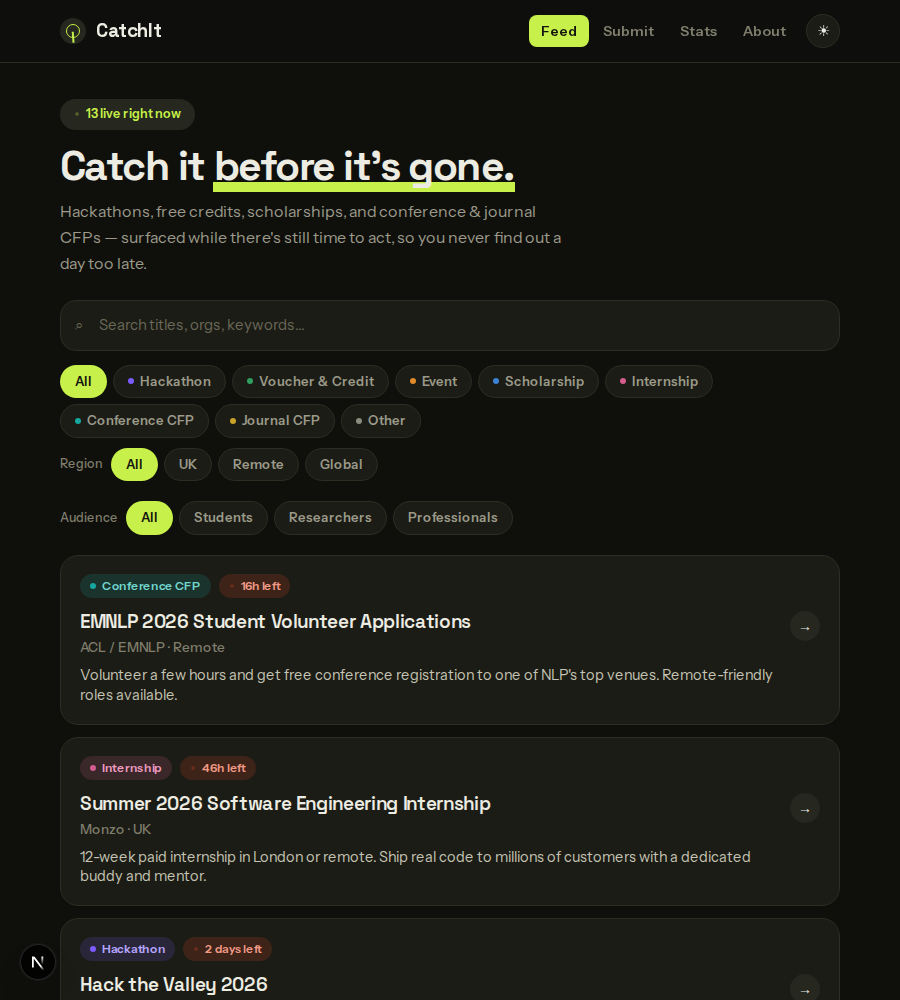
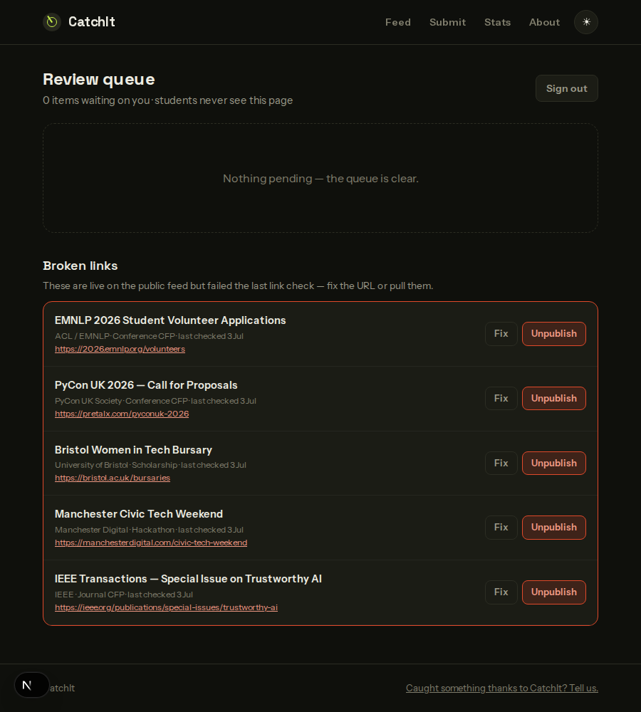

# CatchIt

**Catch it before it's gone.**

CatchIt automatically discovers and publishes career-relevant opportunities for students, researchers, and early-career professionals — hackathons, scholarships, internships, free software/cloud credits, tech events, and conference & journal CFPs — so people stop missing deadlines they'd otherwise never hear about.

Built by [Muhammad Ibrahim](https://github.com/m-khan-97), Vishnu Ajith, and Muhammed Sihan Haroon.

<p>
  
  
</p>

## Tech stack

- [Next.js 16](https://nextjs.org) (App Router) · TypeScript · Tailwind CSS v4
- [Supabase](https://supabase.com) — Postgres + Auth
- [Anthropic API](https://www.anthropic.com) (`@anthropic-ai/sdk`) — Claude Haiku 4.5 with `web_search` for automated discovery
- Vercel + Vercel Cron for hosting and scheduling
- Discord incoming webhook for review notifications

## Project status

Full build plan: [`catchit-build-plan.md`](catchit-build-plan.md).

- [x] **Milestone 1** — Scaffold, design system, database schema, Supabase auth plumbing
- [x] **Milestone 2** — Public site: feed, filters, search, detail pages, calendar export, submission form, stats, about page, SEO
- [x] **Milestone 3** — Admin panel (multi-admin review queue)
- [x] **Milestone 4** — Discovery pipeline (Devpost + WikiCFP + AI search + dedup)
- [x] **Milestone 5** — Discord webhook integration
- [x] **Milestone 6** — Polish, docs, deploy (public JSON API, dead-link checking, OG images, this README)

Progress is tracked via [GitHub Milestones](../../milestones).

## Getting started

```bash
npm install
cp .env.example .env.local   # fill in your Supabase project + keys
npm run dev
```

Open [http://localhost:3000](http://localhost:3000).

### Database setup

1. Create a project at [supabase.com/dashboard](https://supabase.com/dashboard).
2. Run the migration in `supabase/migrations/` via the SQL Editor (or `supabase db push` once linked).
3. Optionally run `supabase/seed.sql` for sample data to develop against.
4. Copy your Project URL, `anon` key, and `service_role` key from **Project Settings → API** into `.env.local`.

See `.env.example` for every environment variable the app needs and what each one is for.

## Adding an admin

Admins are a named allowlist (`admin_users` table), not a single shared login. To add one:

1. Create the Supabase Auth user — either in the dashboard (**Authentication → Users → Add user**) or via the Admin API:
   ```bash
   curl -X POST "$NEXT_PUBLIC_SUPABASE_URL/auth/v1/admin/users" \
     -H "apikey: $SUPABASE_SERVICE_ROLE_KEY" \
     -H "Authorization: Bearer $SUPABASE_SERVICE_ROLE_KEY" \
     -H "Content-Type: application/json" \
     -d '{"email":"person@example.com","password":"...","email_confirm":true}'
   ```
   The response includes the new user's `id`.
2. Add a matching row to `admin_users` (SQL Editor, or REST with the service role key):
   ```sql
   insert into admin_users (id, email, display_name)
   values ('<id-from-step-1>', 'person@example.com', 'Person Name');
   ```
3. They can now sign in at `/admin` with that email/password.

Without a matching `admin_users` row, a signed-in account sees "Not on the admin team" rather than the review queue — signing in alone doesn't grant access.

## Running the discovery job manually

The pipeline is a single authenticated route, not a special CLI — trigger it the same way Vercel Cron does:

```bash
curl -X GET "http://localhost:3000/api/cron/discover" \
  -H "Authorization: Bearer $CRON_SECRET"
```

This runs Devpost, WikiCFP, and all six AI-search categories, dedupes against existing rows, inserts survivors as `pending`, and returns a JSON summary (`found`/`inserted`/`skipped`/`failed` per source). A full run typically takes 60–120 seconds locally. The same-shaped summary is also logged to the `discovery_runs` table for later inspection.

Requires `ANTHROPIC_API_KEY` to be set and to have credits — the AI-search sources will otherwise fail per-query (logged, not fatal) while Devpost/WikiCFP still run.

The dead-link checker follows the same pattern:

```bash
curl -X GET "http://localhost:3000/api/cron/check-links" \
  -H "Authorization: Bearer $CRON_SECRET"
```

## Public JSON API

`GET /api/opportunities` returns the same approved, non-expired feed as the site, as JSON — for embedding in a Moodle/VLE page, a student society site, or anywhere else that shouldn't have to scrape HTML. Supports the same filters as the feed: `?category=`, `?region=`, `?audience=`, `?q=`. CORS-open (read-only public data, no auth) and cached for 5 minutes.

## Deploying to Vercel

1. Push this repo to GitHub (already done if you're reading this from the deployed repo), then **Import Project** on [vercel.com](https://vercel.com/new).
2. Add every variable from `.env.example` under **Project Settings → Environment Variables** — `NEXT_PUBLIC_SUPABASE_URL`, `NEXT_PUBLIC_SUPABASE_ANON_KEY`, `SUPABASE_SERVICE_ROLE_KEY`, `ANTHROPIC_API_KEY`, `CRON_SECRET`, `DISCORD_WEBHOOK_URL`, and `NEXT_PUBLIC_SITE_URL` (your production domain, no trailing slash).
3. Deploy. `vercel.json` already defines both cron jobs — Vercel picks them up automatically:
   - `/api/cron/discover` — daily at 06:00 UTC
   - `/api/cron/check-links` — weekly, Monday 07:00 UTC
4. Confirm the cron jobs are registered under **Project Settings → Cron Jobs**, and that the same `CRON_SECRET` value is set in the environment (Vercel Cron sends it automatically as the `Authorization` header on scheduled invocations).
5. Run the Supabase migration against your production project if you haven't already (see Database setup above) — this is a separate project from any local/dev Supabase instance you were using.

## Non-negotiables

- Every published opportunity links to the *original* source — CatchIt never rehosts application content.
- No login required to browse; auth is admin-only.
- Row Level Security enforced at the database layer, not just in application code.
- Nothing new is ever auto-approved — every discovered or submitted opportunity lands in the admin queue first.
